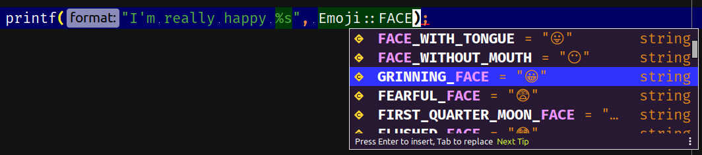

# Emoji catalog 📔

Get access to +3700 emojis as class constants.

Features:

- 🍰 Dead easy to use
- 🤩 A lot of emojis
- 🔓 Zero dependencies

You can see the [full emoji list].

[](https://packagist.org/packages/jawira/emoji-catalog)
[](https://packagist.org/packages/jawira/emoji-catalog)

## Usage

You have access to emojis as `\Jawira\EmojiCatalog\Emoji` constants:

```php
<?php
use Jawira\EmojiCatalog\Emoji;

echo Emoji::GRINNING_FACE;  // 😀
echo Emoji::SOCCER_BALL;    // ⚽
echo Emoji::HOURGLASS_DONE; // ⌛
echo Emoji::EJECT_BUTTON;   // ⏏
```

Your favorite IDE should give you autocomplete since you are simply calling
class constants:



## How to install

```console
composer require jawira/emoji-catalog
```

## Emoji sequences

An _emoji sequence_ is an emoji composed of other emojis. For example the
character "👨‍👩‍👧" is composed of five characters: _U+1F468 U+200D U+1F469
U+200D U+1F467_.

You don't need to compose your emojis, _jawira/emoji-catalog_ comes with all
possible sequences as class constants:

```php
echo Emoji::FAMILY_MAN_WOMAN_GIRL; // 👨‍👩‍👧
```

## Contributing

- If you liked this project, ⭐ star it on [GitHub]
  . [][GitHub]
- Or follow me on
  Twitter. [](https://twitter.com/jawira)

## License

This library is licensed under the [MIT license](LICENSE.md).

[GitHub]: https://github.com/jawira/emoji-catalog

[full emoji list]: https://github.com/jawira/emoji-catalog/blob/master/docs/catalog.md

***

## Packages from jawira

<dl>

<dt>
    <a href="https://packagist.org/packages/jawira/plantuml">jawira/plantuml
    </a>
</dt>
<dd>Provides PlantUML executable and plantuml.jar</dd>

<dt>
    <a href="https://packagist.org/packages/jawira/plantuml-encoding"> jawira/plantuml-encoding
    </a>
</dt>
<dd>PlantUML encoding functions.</dd>

<dt>
    <a href="https://packagist.org/packages/jawira/case-converter">jawira/case-converter 
    </a>
</dt>
<dd>Convert strings between 13 naming conventions: Snake case, Camel case,
  Pascal case, Kebab case, Ada case, Train case, Cobol case, Macro case,
  Upper case, Lower case, Sentence case, Title case and Dot notation.
</dd>

<dt><a href="https://packagist.org/packages/jawira/">More...</a></dt>
</dl>
